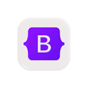

## Hi there 👋

<!--
**chosen03/chosen03** is a ✨ _special_ ✨ repository because its `README.md` (this file) appears on your GitHub profile.

Here are some ideas to get you started:

- 🔭 I’m currently working on ...
- 🌱 I’m currently learning ...
- 👯 I’m looking to collaborate on ...
- 🤔 I’m looking for help with ...
- 💬 Ask me about ...
- 📫 How to reach me: ...
- 😄 Pronouns: ...
- ⚡ Fun fact: ...
-->### I'm Michael
>#### 🙋🏽‍♂️About Me
- 🧑‍💻 Software Engineer | 2years experience.

  

>#### 👨🏽‍💻Tech Stack
- Python/Django/Django-Rest-framework
- HTML/CSS/Bootstrap
- JavaScript

>#### Backend

>#### Frontend

